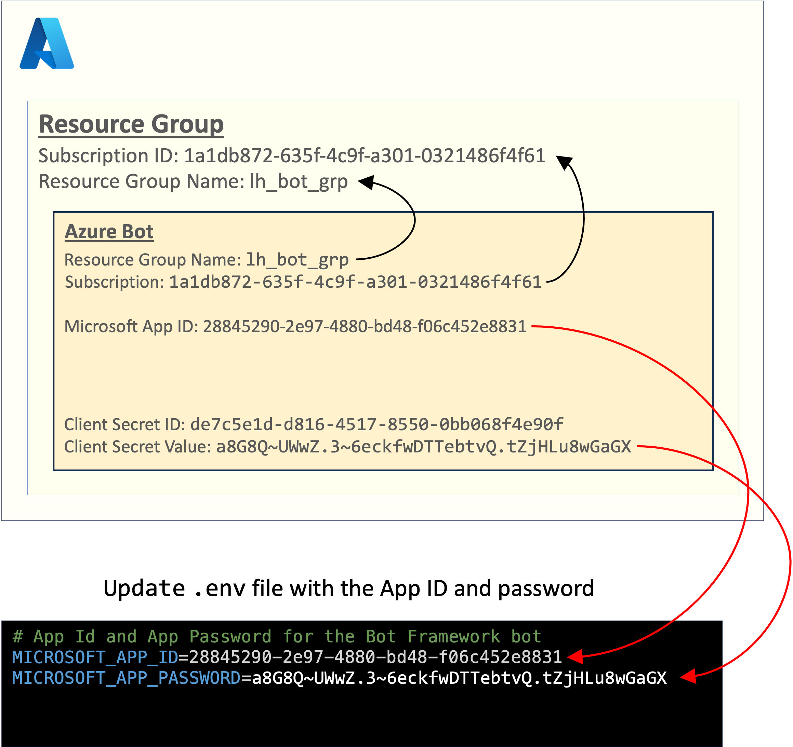

# Proof-of-Concpet Project to Integrate SAP with MS Teams

This is a work in progress!

Before an MS Teams app can be built, you must first configure an Azure Bot within an Azure Resource Group:

* [Prerequisites](./docs/prerequisites.md)
* [Initial Setup](./docs/initial_setup.md)
* [Setting up a basic bot](./docs/basic_bot_setup.md)
