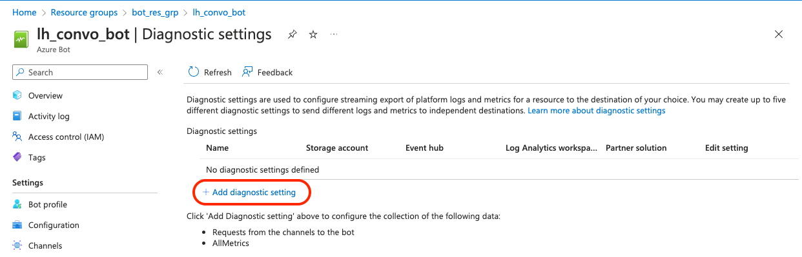
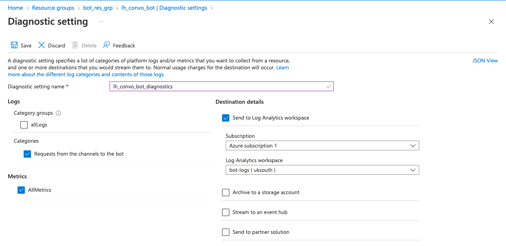

# Configure Bot's Diagnostic Settings

Select your bot from *Home* &rarr; *Resource Groups* &rarr; &lt;your resource group&gt; &rarr; &lt;bot name&gt;, then under *Monitoring*, select *Diagnostic settings*.

Give the diagnostic configuration a name (in our case `lh_convo_bot_diagnostics`), then select:

* Messages coming from a client over the various communication channels
* All metrics
* Send these massages to the log analytics workspace we've just created

