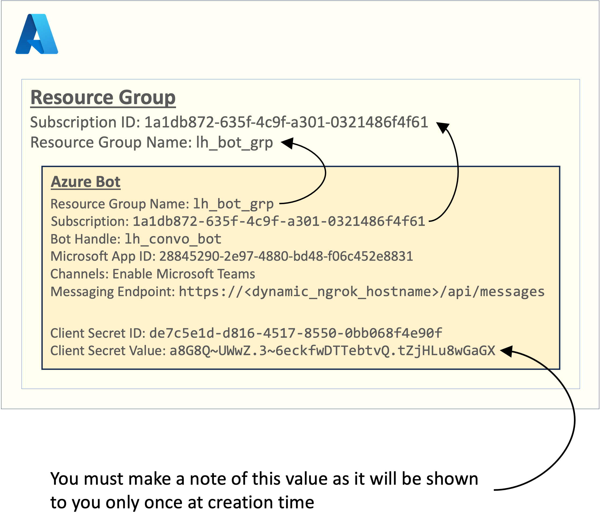

# Azure Bot Creation

Log on to your Azure account and create a Resource group.
Then within this resource group create an Azure Bot.

Here, the resource group has been called `lh_bot_group` and the bot has been called `lh_convo_bot`.

Once the bot is created, you must additionally create a secret and make a note of the password.

