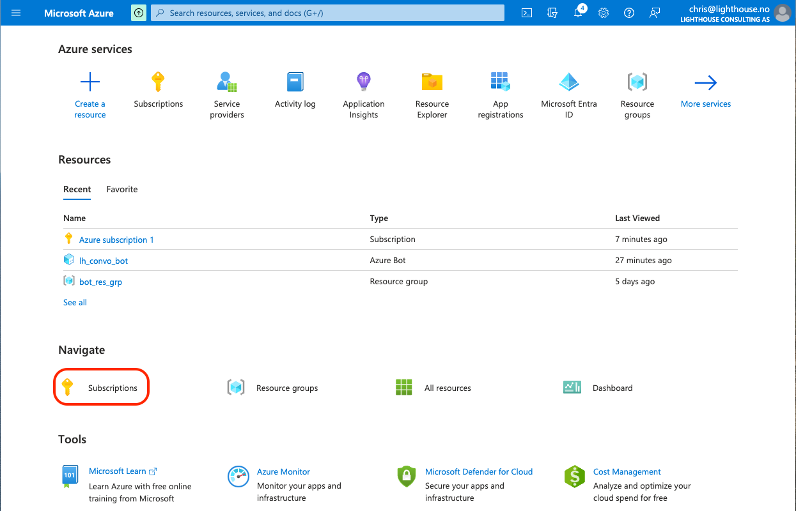
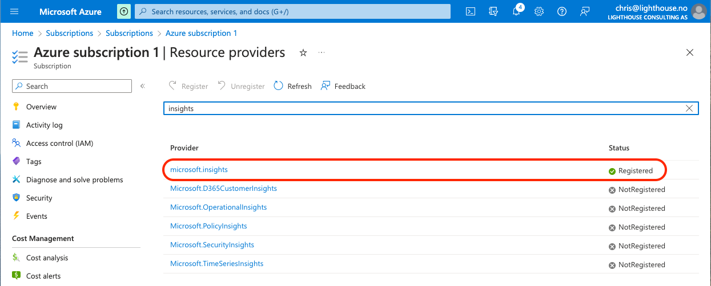

# Initial Azure Configuration

## Bot Creation

Log on to your Azure account and create a Resource group.
Then within this resource group create an Azure Bot.

Here, the resource group has been called `lh_bot_group` and the bot has been called `lh_convo_bot`.

Once the bot is created, you must additionally create a secret and make a note of the password.

## Enable Logging Analytics

In order to obtain log analytics about any errors that might occur during development, you must first ensure that your Azure subscription has registered the use of the `microsoft.insights` resource provider.

To check this, log on to Azure and select your subscription.

Select your subscription, then on the next screen, select Resource Provider from the menu items on the left.

If this resource provider is not registered, select it then click on register at the top of the screen.
