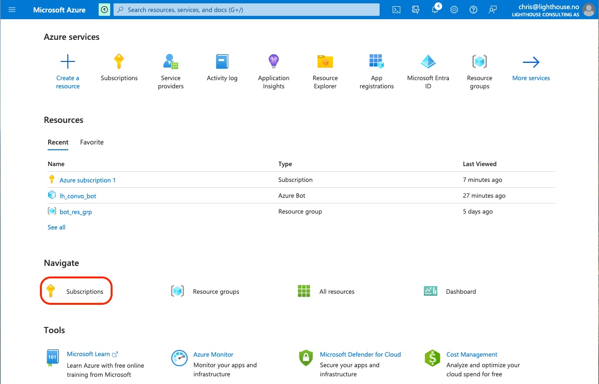
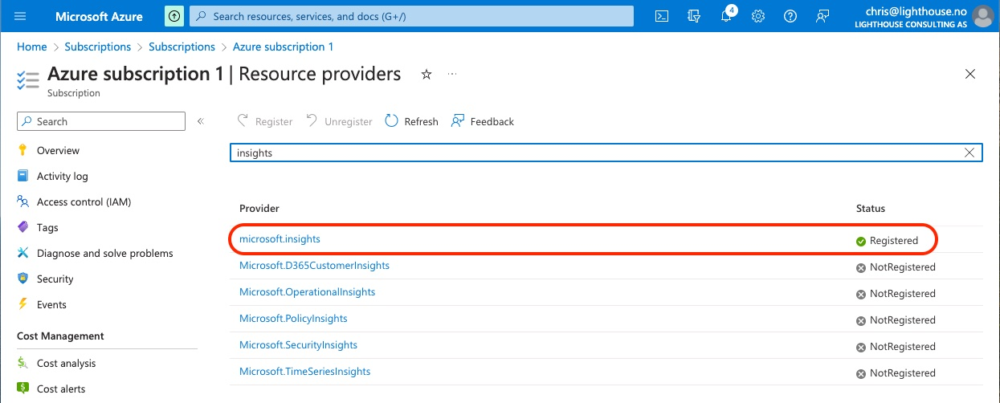
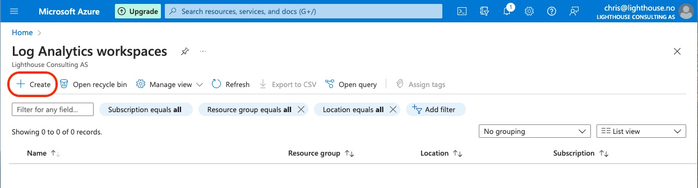
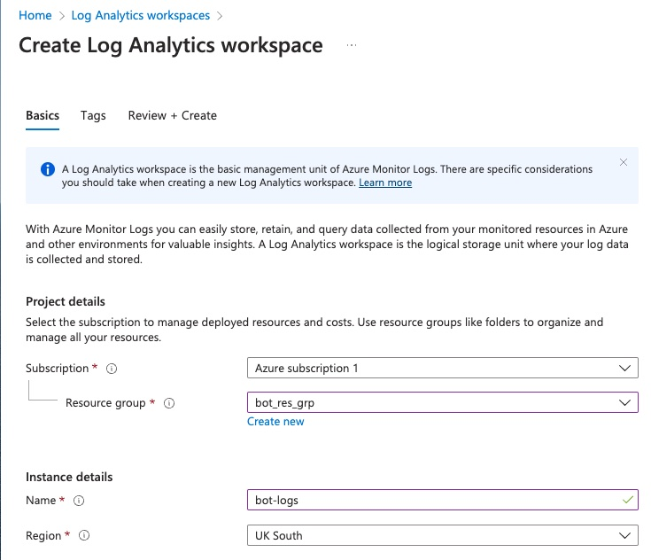

# Configure Azure Logging

## Register `microsoft.insights`

In order to obtain log analytics about any errors that might occur during development, you must first ensure that your Azure subscription has registered the use of the `microsoft.insights` resource provider.
This is a general purpose declaration that enables log anaytics functionality for your entire Azure subscription.

To check this, log on to Azure and select your subscription.

Select your subscription, then on the next screen, select Resource Provider from the menu items on the left.

If this resource provider is not registered, then select it and click on register at the top of the screen.

## Create Log Analytics Workspace Instance

Once your Azure subscription has registered the use of insights functionality, you must now declare, for a given resource group, where you want analytics information to be written.
There are several possible choices, but here we will create a Log Analytics Workspace.

From the Azure front screen, search for "Log Analytics workspaces" and press create:

Select the resource group within which your bot exists and give the log analytics workspace instance a name.

Once the log analytics workspace instance has been created, you can now configure your bot's log information to be written into this workspace.
