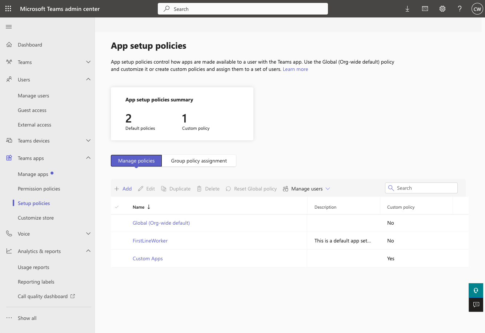
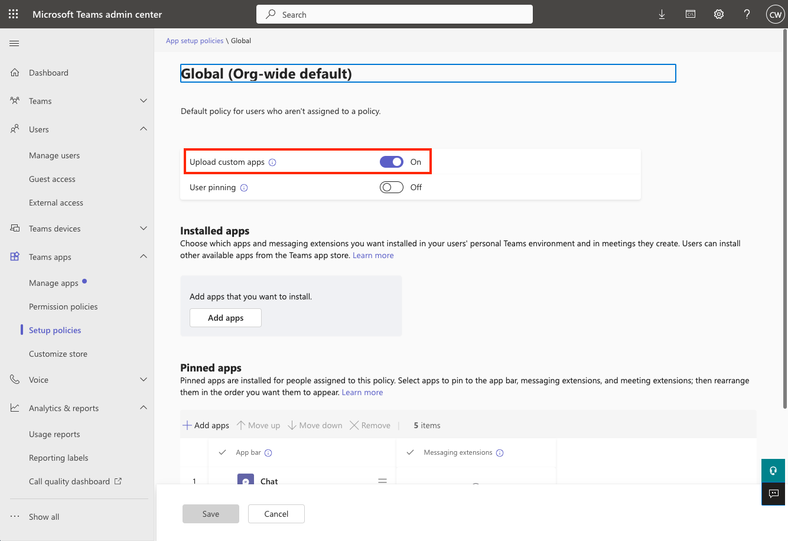
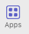
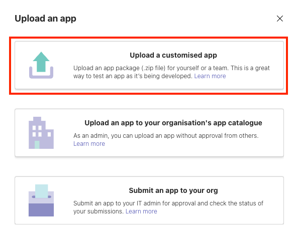

# Initial Setup

1. Install Visual Studio Code
1. Ensure Sideloading for Teams Apps is enabled

   From your [Teams Admin Centre](https://admin.teams.microsoft.com/), select *Teams apps* &rarr; *Setup policies*

   

   Select the *Global (Org-wide default)* policy and switch on *Upload custom apps*

   

   Microsoft define sideloading as:

   > This setting determines if a user can upload a custom app package in the Teams app. Turning it on lets you create or develop a custom app to be used personally or across your organization without having to submit it to the Teams app store. Uploading a custom app also lets you test an app before you distribute it more widely by only assigning it to a single user or group of users.

   The non-intuitive part here is that Microsoft uses inconsistent terminology.

   The term "sideloading" is used in the Teams Toolkit software, but is not used in the documentation.
   Instead, the documentation almost always refers to "Uploading custom apps"

   Without this setting switched on, you will not be able to test your Teams app without first making it available to your entire organisation.

2. Check that sideloading has been correctly enbled.

   In MS Teams, click on  at the bottom of the toolbar on the left, then select  at the bottom of the screen and then 

   If sideloading has been enable, you will see this option 

3. In VSCode, install the Teams Toolkit plugin in and connect to your Teams installation using your admin account.
   When the plugin connects to your Teams account, it will automatically check whether sideloading is enabled.
   If it is not, this is considered an error as although testing is possible, it is not nearly so convenient.

   It is possible that even though you have correctly enabled sideloading, the Teams Toolkit still reports that sideloading is not available in your Microsoft 365 account.

   In this case, you can still upload your custom app through the MS Teams desktop app.
